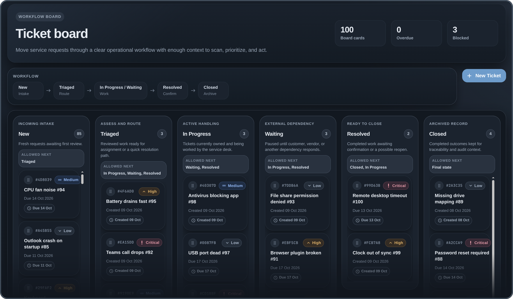
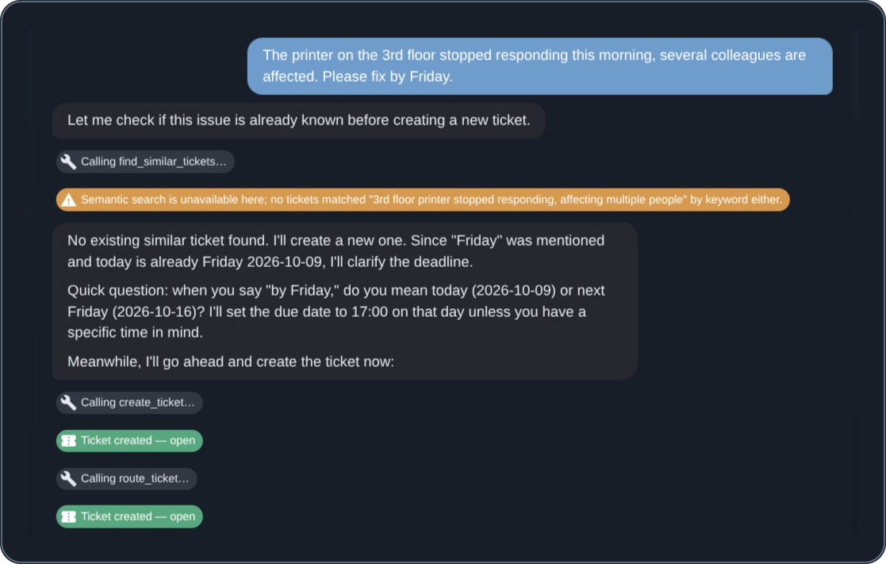

<div align="center">

# ServiceDeskLite

**A small service desk I built to put Clean Architecture into practice, and later used for my first experiments with an AI assistant.**

[](#status)
[](https://github.com/goldbarth/ServiceDeskLite/releases/latest)
[](https://github.com/goldbarth/ServiceDeskLite/actions/workflows/ci.yml)
[](https://goldbarth.github.io/ServiceDeskLite/)
[](https://goldbarth.github.io/ServiceDeskLite/adr/index.html)
[](LICENSE)


</div>

ServiceDeskLite is a small service desk on .NET 10: tickets, a workflow that knows which status may follow which, comments, assignment and an audit trail.
The domain is small on purpose.

The repository has two parts, and they don't have the same standing:

- **The architecture** is what I built it for.
- **The AI assistant** came later, as an experiment in LLM integration and in working with coding agents.

<p align="center">
  
  <br>
  <sub>The ticket board. Each lane names the statuses a ticket may move to next, straight from the domain's workflow rules.</sub>
</p>

## Why this exists

I built this to put Clean Architecture into practice.
A service desk is small, and it still raises the questions a diagram skips: where validation lives, how a failure crosses a layer, and what it takes to actually swap the database.

The assistant came afterwards, as a way to learn LLM integration: tool calling, streaming, retrieval.
It was also my first larger piece of agentic engineering.
Coding agents wrote most of that code, and I steered more than I reviewed line by line.
So it has not had the scrutiny the architecture underneath it has, and it is an experiment, not a reference.

## The architecture

```text
┌─────────────────────────────────────┐
│              Web (Blazor)           │  MudBlazor UI
├─────────────────────────────────────┤
│           API (Minimal API)         │  Endpoints, ProblemDetails
├───────────────────┬─────────────────┤
│  Infrastructure   │  Infra.InMemory │  EF Core/PostgreSQL │ in-process store
├───────────────────┴─────────────────┤
│           Application               │  Use cases, validation, ports, UoW
├─────────────────────────────────────┤
│              Domain                 │  Entities, workflow rules, events
└─────────────────────────────────────┘
```

Seven projects, and the references between them only point inward.

- **The domain knows nothing but itself.**
  Entities, the workflow rules, and the events a state change raises.
- **The application layer owns the use cases and the ports.**
  Every handler returns a `Result`, so an expected failure is a value and not an exception.
  The API turns it into RFC 9457 ProblemDetails in one place.
- **Persistence is swappable, and the swap is tested.**
  EF Core on PostgreSQL and an in-memory store implement the same ports, and the end-to-end suite runs against both.
- **Every state change is audited.**
  A domain event becomes an audit record, whoever caused it.

Every choice that wasn't obvious is written down as an ADR.
These are the ones the architecture rests on:

| ADR | Decision | In short |
|-----|----------|----------|
| [0001](docs/adr/0001-hexagonal-layered-architecture.md) | Hexagonal layering | Ports and adapters, dependencies strictly inward |
| [0002](docs/adr/0002-result-pattern.md) | Result pattern | Expected failures are values, not exceptions |
| [0003](docs/adr/0003-problem-details.md) | RFC 9457 ProblemDetails | One machine-readable error contract over HTTP |
| [0004](docs/adr/0004-minimal-api-no-mediatr.md) | No MediatR | Plain handlers, no pipeline in between |
| [0005](docs/adr/0005-strongly-typed-ids.md) | Strongly-typed ids | `TicketId` instead of a bare `Guid` |
| [0007](docs/adr/0007-swappable-persistence.md) | Swappable persistence | Same ports, two implementations, both tested |
| [0009](docs/adr/0009-deterministic-paging.md) | Deterministic paging | Stable sort keys, reproducible pages |
| [0019](docs/adr/0019-field-level-validation.md) | Field-level validation | Errors addressable per input field |

The [architecture overview](https://goldbarth.github.io/ServiceDeskLite/architecture/overview.html) goes through it layer by layer, and the [ADR index](https://goldbarth.github.io/ServiceDeskLite/adr/index.html) has all 42.

## The assistant experiment

You describe a problem in your own words.
Claude decides what to do about it, through twelve tools.
The whole integration sits at the edge, in the API project.
Each tool ends in the same command handler the REST API uses, so validation and the audit trail apply to the assistant as they do to everyone else.

<p align="center">
  
  <br>
  <sub>A report in free text: a duplicate check, a question about the vague deadline, then the ticket is filed and routed, one visible tool call at a time.</sub>
</p>

What I tried out along the way:

- **Tool calling and streaming.** Answers reach the browser token by token over server-sent events, with each tool call visible as it happens.
- **Retrieval.** A duplicate check before a ticket is filed, and knowledge-base answers that cite their passages and are checked against them.
- **Guards.** A pipeline every tool call has to pass: unknown tools refused, argument size capped, writes budgeted, calls rate limited.
- **A background worker.** The same loop going through open tickets on its own, held by a review guard that leaves high-impact changes to a person.
- **Measuring it.** Metrics, traces and a page that reports what the assistant did.

Semantic search needs PostgreSQL with pgvector and a Voyage AI key.
Without them the assistant says so and carries on with keyword results.

The [assistant page](docs/architecture/assistant.md) goes through each part, and ADRs 0023 to 0042 record the decisions made along the way.

## Status

`v1.9.0` is the latest release, and where the project stands.
I am not developing it further, and nothing more is planned.

| What runs | Decided in |
|-----------|------------|
| Ticket workflow on an explicit state machine: create, search, update, status, assignment, comments | [Domain](https://goldbarth.github.io/ServiceDeskLite/architecture/domain.html) |
| Result-based flow with RFC 9457 errors and field-level validation | [0002](docs/adr/0002-result-pattern.md), [0003](docs/adr/0003-problem-details.md), [0019](docs/adr/0019-field-level-validation.md) |
| Two persistence adapters behind the same ports | [0007](docs/adr/0007-swappable-persistence.md) |
| Audit trail, and a transactional outbox that stages but doesn't dispatch | [0020](docs/adr/0020-audit-event-payload-format.md), [0021](docs/adr/0021-outbox-stub.md) |
| The assistant: twelve tools over the command handlers, streamed | [0023](docs/adr/0023-ai-assistant-edge-adapter.md) |
| Ticket and knowledge-base retrieval, with citations and a grounding check | [0029](docs/adr/0029-knowledge-base-rag.md), [0030](docs/adr/0030-hybrid-ticket-retrieval.md), [0039](docs/adr/0039-grounding-check-enforcement.md) |
| The guard pipeline and the background worker | [0035](docs/adr/0035-agent-sandbox.md), [0037](docs/adr/0037-autonomous-ticket-worker.md) |
| Metrics, traces and the AI Insights page | [0034](docs/adr/0034-ai-operations-metrics.md), [0036](docs/adr/0036-observability.md) |

Left out on purpose:

- Real authentication and authorization.
  The API key middleware is a demo-grade guard, not an identity system.
- Outbox dispatching.
  Messages are staged in the same transaction as the state change, and not relayed to a broker ([ADR-0021](docs/adr/0021-outbox-stub.md)).
- Re-ranking, a full-text index and a vector index, all cut at this data size ([ADR-0024](docs/adr/0024-semantic-ticket-search-rag.md), [ADR-0030](docs/adr/0030-hybrid-ticket-retrieval.md)).
- A UI in more than one language.

## Running it

You need the .NET 10 SDK and an Anthropic API key.
The API checks the key at startup and won't boot without one.

```bash
dotnet user-secrets set Anthropic:ApiKey sk-ant-... --project src/ServiceDeskLite.Api

dotnet run --project src/ServiceDeskLite.Api    # terminal 1: the API, in-memory store with demo data
dotnet run --project src/ServiceDeskLite.Web    # terminal 2: the UI at http://localhost:5310
```

The [runbook](docs/operations/runbook.md) has the Docker setup with PostgreSQL, the optional keys, and a demo flow to click through.

The tests need neither a database nor a key, because the test hosts inject fakes:

```bash
dotnet test
```

CI runs every suite on each push, the end-to-end suite against both persistence adapters, and checks the OpenAPI contract against a snapshot.

## Documentation

The rest is on the [documentation site](https://goldbarth.github.io/ServiceDeskLite/), built from `docs/` with DocFX:

- [Architecture overview](https://goldbarth.github.io/ServiceDeskLite/architecture/overview.html), layer by layer
- [ADR index](https://goldbarth.github.io/ServiceDeskLite/adr/index.html), all 42 decision records
- [The assistant](docs/architecture/assistant.md), part by part
- [OpenAPI reference and Swagger UI](https://goldbarth.github.io/ServiceDeskLite/api/openapi.html)
- [Testing overview](https://goldbarth.github.io/ServiceDeskLite/testing/overview.html)
- [Runbook](docs/operations/runbook.md)

## License

Licensed under the [MIT License](LICENSE). © 2026 Felix Wahl.

Related: [Chartula](https://github.com/goldbarth/chartula), a grounded changelog CLI in .NET, [retrieval-regression-harness](https://github.com/goldbarth/retrieval-regression-harness), a regression test for RAG retrieval, and [goldbarth.dev](https://www.goldbarth.dev/), where the experiments behind them are written up.
