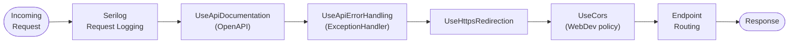
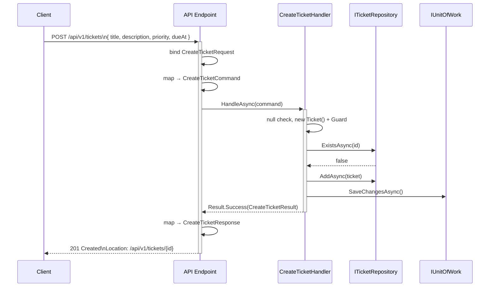
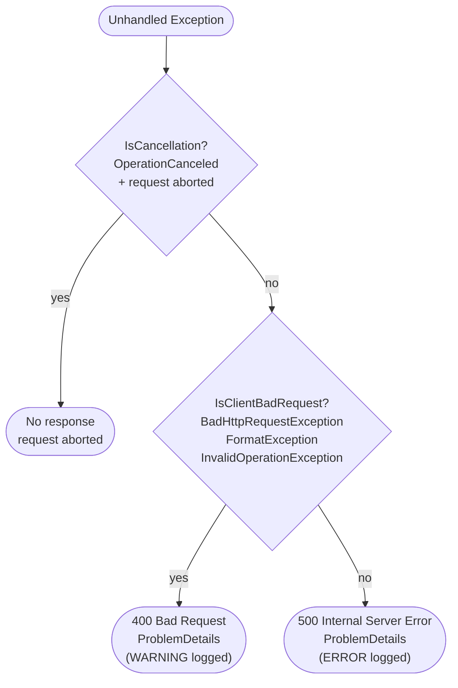

## API Layer (`ServiceDeskLite.Api`)

#### Middleware Pipeline Order (`Program.cs`)

```
1.  Serilog configuration (before WebApplication builder)
2.  Services:
      AddApiDocumentation        → OpenAPI
      AddApiErrorHandling        → ProblemDetails + ExceptionHandler + Mapper
      AddApplication             → use-case handlers (Scoped)
      AddApiInfrastructure       → persistence provider switch
3.  EF Core auto-migration (Sqlite only)
4.  app.UseSerilogRequestLogging()
5.  app.UseApiDocumentation()
6.  app.UseApiErrorHandling()     → UseExceptionHandler()
7.  app.UseHttpsRedirection()
8.  app.UseCors("WebDev")         → https://localhost:7023 only
9.  Endpoint mapping
```



#### Endpoints (`TicketsEndpoints.cs`)

Base route group: `/api/v1/tickets`

| HTTP | Route                     | Handler             | Returns                                          |
|------|---------------------------|---------------------|--------------------------------------------------|
| POST | /api/v1/tickets           | CreateTicketAsync   | 201 Created + CreateTicketResponse               |
| GET  | /api/v1/tickets/{id:guid} | GetTicketByIdAsync  | 200 OK + TicketResponse                          |
| GET  | /api/v1/tickets           | SearchTicketsAsync  | 200 OK + PagedResponse\<TicketListItemResponse\> |

All errors return RFC 9457 ProblemDetails via `ResultToProblemDetailsMapper`.

#### Request Lifecycle

The following sequence covers the `POST /api/v1/tickets` happy path. All other endpoints follow the same structure.



#### Correlation

```csharp
public static class Correlation
{
    public static string GetTraceId(HttpContext ctx)
        => Activity.Current?.Id
           ?? ctx.TraceIdentifier
           ?? "unknown";
}
```

TraceId is attached to every ProblemDetails response as the `traceId` extension field.

#### `ResultToProblemDetailsMapper`

```csharp
public sealed class ResultToProblemDetailsMapper
{
    public IResult ToHttpResult<T>(
        HttpContext ctx, Result<T> result, Func<T, IResult> onSuccess)

    public IResult ToProblem(HttpContext ctx, ApplicationError error)
}
```
Uses `ApiProblemDetailsFactory` to produce RFC 9457 responses with extensions:
`code`, `errorType`, `traceId`, `meta`.

#### `ResultMappingExtensions`

Fluent bridge: `result.ToHttpResult(ctx, mapper, value => Results.Ok(value.ToResponse()))`.

#### Exception Handling Pipeline

- `ApiExceptionHandler : IExceptionHandler` catches all unhandled exceptions
- `ExceptionClassification.IsClientBadRequest(ex)` → `BadHttpRequestException, FormatException, InvalidOperationException` → 400
- `ExceptionClassification.IsCancellation(ex, ctx)` → request cancelled → no response
- All other exceptions → 500 Unexpected

Logging: 5xx → ERROR, 409 → WARNING, 400 → WARNING, others → INFO.



#### Enum Mapping (`Api/Mapping/Tickets/TicketEnumMapping.cs`)

```csharp
// Contracts → Domain
public static DomainTicketPriority ToDomain(this TicketPriority value)

// Contracts → Application
public static AppTicketSortField  ToApplication(this TicketSortField value)
public static AppSortDirection    ToApplication(this SortDirection value)

// Application → Contracts
public static TicketResponse           ToResponse(this TicketDetailsDto dto)
public static TicketListItemResponse   ToListItemResponse(this TicketListItemDto dto)
public static Paging                   ToPaging(this SearchTicketsRequest request)
public static SortSpec?                ToSort(this SearchTicketsRequest request)
public static PagedResponse<TicketListItemResponse>
    ToPagedResponse(this PagedResult<TicketListItemDto> page)
```

#### `appsettings.json` (Production)

```json
{
    "Logging": { "LogLevel": { "Default": "Information", "Microsoft.AspNetCore": "Warning" } },
    "Persistence": { "Provider": "Sqlite" },
    "ConnectionStrings": { "ServiceDeskLite": "Data Source=servicedesklite.db" },
    "AllowedHosts": "*"
}
```

#### `appsettings.Development.json`

```json
{
    "Logging": { "LogLevel": { "Default": "Information", "Microsoft.AspNetCore": "Warning" } },
    "Persistence": { "Provider": "InMemory" }
}
```