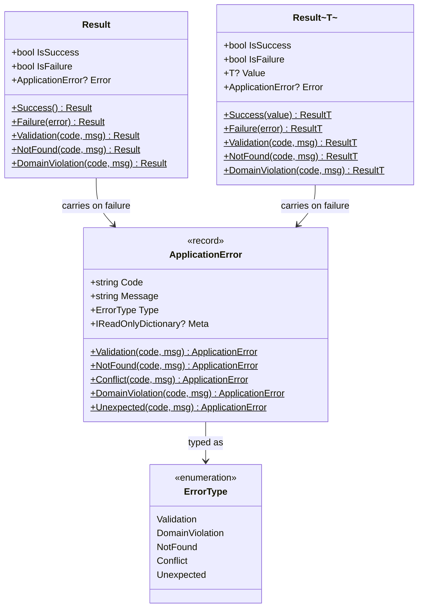
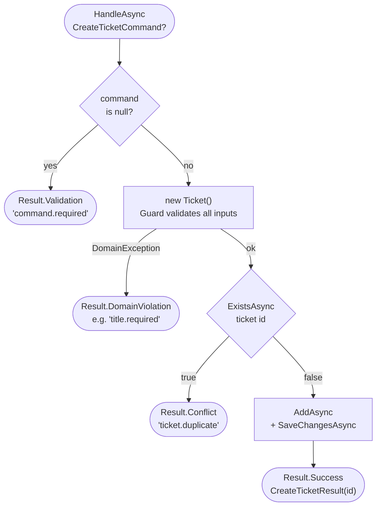

## Application Layer (`ServiceDeskLite.Application`)

#### Result Pattern

Handlers never throw. All outcomes are expressed via `Result` or `Result<T>`.

#### `Result` (void success)

```csharp
public class Result
{
    public bool IsSuccess { get; }
    public bool IsFailure => !IsSuccess;
    public ApplicationError? Error { get; }

    public static Result Success()
    public static Result Failure(ApplicationError error)
    public static Result NotFound(string code, string message,
        IReadOnlyDictionary<string, object>? meta = null)
    public static Result Validation(string code, string message,
        IReadOnlyDictionary<string, object>? meta = null)
    public static Result DomainViolation(string code, string message,
        IReadOnlyDictionary<string, object>? meta = null)
}
```

#### `Result<T>` (value on success)

```csharp
public class Result<T>
{
    public bool IsSuccess { get; }
    public bool IsFailure => !IsSuccess;
    public T? Value { get; }       // Throws InvalidOperationException if IsFailure
    public ApplicationError? Error { get; }

    public static Result<T> Success(T value)
    public static Result<T> Failure(ApplicationError error)
    public static Result<T> NotFound(string code, string message,
        IReadOnlyDictionary<string, object>? meta = null)
    public static Result<T> Validation(string code, string message,
        IReadOnlyDictionary<string, object>? meta = null)
    public static Result<T> DomainViolation(string code, string message,
        IReadOnlyDictionary<string, object>? meta = null)
}
```

#### `ApplicationError`

```csharp
public sealed record ApplicationError(
    string Code,
    string Message,
    ErrorType Type,
    IReadOnlyDictionary<string, object>? Meta = null)
{
    public static ApplicationError Validation(string code, string message, ...)
    public static ApplicationError NotFound(string code, string message, ...)
    public static ApplicationError Conflict(string code, string message, ...)
    public static ApplicationError DomainViolation(string code, string message, ...)
    public static ApplicationError Unexpected(string code, string message, ...)
}
```

#### Result & Error Type Model



#### `ErrorType` → HTTP Status Mapping

| ErrorType         | HTTP Status |
|-------------------|-------------|
| `Validation`      | 400         |
| `DomainViolation` | 400         |
| `NotFound`        | 404         |
| `Conflict`        | 409         |
| `Unexpected`      | 500         |

#### Use Case Handlers

Each use case lives in its own folder under `Application/Tickets/<UseCase>/`. Structure:

- `<UseCase>Command.cs` or `<UseCase>Query.cs` – input record
- `<UseCase>Handler.cs` – handler with `HandleAsync` method
- `<UseCase>Result.cs` or `<UseCase>Dto.cs` – output record/DTO

#### Handler signature contract:

```csharp
public async Task<Result<TOutput>> HandleAsync(TInput? input, CancellationToken ct = default)
// Null input → return Result<T>.Validation(...), never throw
```

All handlers follow the same guard-then-act pattern. `CreateTicket` is the canonical example:



#### `CreateTicket`

```csharp
public sealed record CreateTicketCommand(
    string Title,
    string Description,
    TicketPriority Priority,
    DateTimeOffset CreatedAt,
    DateTimeOffset? DueAt = null);

public sealed record CreateTicketResult(TicketId Id);

// Handler: validates null, catches DomainException, checks duplicate (ExistsAsync),
//          AddAsync + SaveChangesAsync
public sealed class CreateTicketHandler
{
    public async Task<Result<CreateTicketResult>> HandleAsync(
        CreateTicketCommand? command, CancellationToken ct = default)
}
```

#### `GetTicketById`

```csharp
public sealed record GetTicketByIdQuery(TicketId Id);

public record TicketDetailsDto(
    TicketId Id,
    string Title,
    string Description,
    TicketStatus Status,
    TicketPriority Priority,
    DateTimeOffset CreatedAt,
    DateTimeOffset? DueAt);

public sealed class GetTicketByIdHandler
{
    public async Task<Result<TicketDetailsDto>> HandleAsync(
        GetTicketByIdQuery? query, CancellationToken ct = default)
}
```

#### `SearchTickets`

```csharp
public sealed record SearchTicketsQuery(
    TicketSearchCriteria Criteria,
    Paging Paging,
    SortSpec? Sort = null);

public sealed record SearchTickesResult(PagedResult<TicketListItemDto> Page);

public class SearchTicketsHandler
{
    public async Task<Result<SearchTickesResult>> HandleAsync(
        SearchTicketsQuery? query, CancellationToken ct = default)
}
```

#### Shared Application Types

```csharp
public sealed record TicketSearchCriteria(
    string? Text = null,
    IReadOnlyCollection<TicketStatus>? Statuses = null,
    IReadOnlyCollection<TicketPriority>? Priorities = null,
    DateTimeOffset? CreatedFrom = null,
    DateTimeOffset? CreatedTo = null,
    DateTimeOffset? DueFrom = null,
    DateTimeOffset? DueTo = null);

public readonly record struct Paging(int Page, int PageSize)
{
    public int Skip => (Page - 1) * PageSize;
}

public enum SortDirection { Asc, Desc }

public enum TicketSortField { CreatedAt, DueAt, Priority, Status, Title }

public readonly record struct SortSpec(TicketSortField Field, SortDirection Direction)
{
    public static SortSpec Default => new(TicketSortField.CreatedAt, SortDirection.Desc);
}

public sealed record PagedResult<T>(
    IReadOnlyList<T> Items,
    int TotalCount,
    Paging Paging);

public record TicketListItemDto(
    TicketId Id,
    string Title,
    TicketStatus Status,
    TicketPriority Priority,
    DateTimeOffset CreatedAt,
    DateTimeOffset? DueAt);
```

#### Paging Policy Constants

```csharp
public static class PagingPolicy
{
    public const int MinPage = 1;
    public const int MinPageSize = 1;
    public const int DefaultPageSize = 25;
    public const int MaxPageSize = 200;
}
```

#### Repository & Unit of Work Abstractions

```csharp
public interface ITicketRepository
{
    Task AddAsync(Ticket ticket, CancellationToken ct = default);
    Task<Ticket?> GetByIdAsync(TicketId id, CancellationToken ct = default);
    Task<bool> ExistsAsync(TicketId id, CancellationToken ct = default);
    Task<PagedResult<Ticket>> SearchAsync(
        TicketSearchCriteria criteria,
        Paging paging,
        SortSpec sort,
        CancellationToken ct = default);
}

public interface IUnitOfWork
{
    Task SaveChangesAsync(CancellationToken ct = default);
}
```