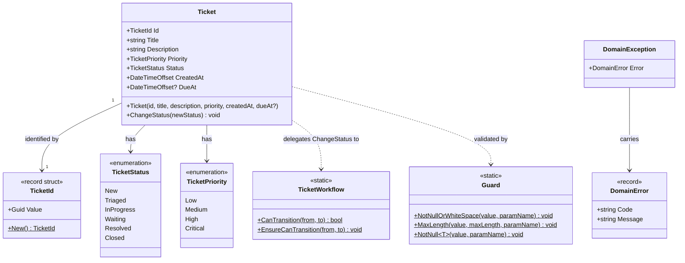
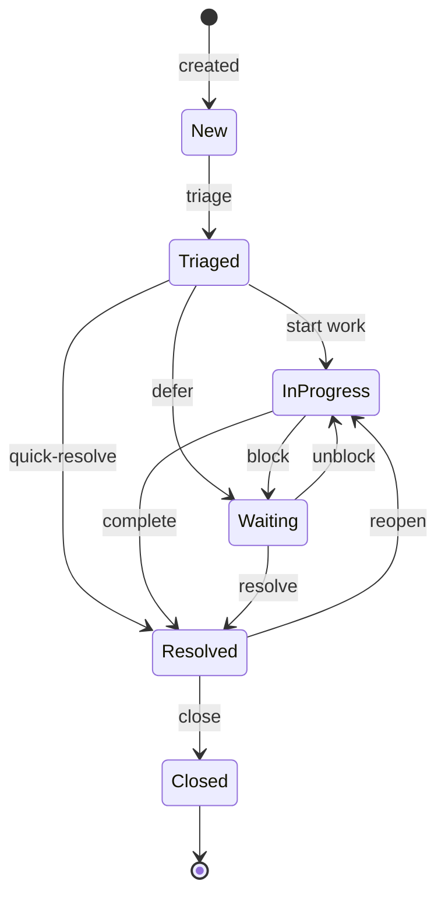

## Domain Layer (`ServiceDeskLite.Domain`)

### `Ticket` Aggregate Root

```csharp
public sealed class Ticket
{
    public TicketId Id { get; }
    public string Title { get; private set; }
    public string Description { get; private set; }
    public TicketPriority Priority { get; private set; }
    public TicketStatus Status { get; private set; }
    public DateTimeOffset CreatedAt { get; }
    public DateTimeOffset? DueAt { get; private set; }

    public Ticket(
        TicketId id,
        string title,
        string description,
        TicketPriority priority,
        DateTimeOffset createdAt,
        DateTimeOffset? dueAt = null)   // Guard validates all inputs

    public void ChangeStatus(TicketStatus newStatus)   // Delegates to TicketWorkflow
}
```
`Ticket` is constructed via its constructor – no factory method, no ORM-only parameterless constructor visible externally. Guard validation runs inside the constructor.

### `TicketId` – Strongly-Typed ID

```csharp
public readonly record struct TicketId(Guid Value)
{
    public static TicketId New() => new(Guid.NewGuid());
}
```

### Enums

```csharp
public enum TicketStatus  { New, Triaged, InProgress, Waiting, Resolved, Closed }
public enum TicketPriority { Low, Medium, High, Critical }
```

### Domain Model



### `TicketWorkflow` – Status Transition Rules

```csharp
private static readonly HashSet<(TicketStatus From, TicketStatus To)> _allowed =
[
    (New,        Triaged),
    (Triaged,    InProgress),
    (Triaged,    Waiting),
    (Triaged,    Resolved),
    (InProgress, Waiting),
    (InProgress, Resolved),
    (Waiting,    InProgress),
    (Waiting,    Resolved),
    (Resolved,   Closed),
    (Resolved,   InProgress),   // Reopen path
];

public static bool CanTransition(TicketStatus from, TicketStatus to)
public static void EnsureCanTransition(TicketStatus from, TicketStatus to)
// Throws DomainException with code "domain.ticket.status.invalid_transition"
```

### Status Transition Diagram



### `Guard` – Invariant Enforcement

```csharp
public static class Guard
{
    // Throws DomainException(code: "domain.not_empty")
    public static void NotNullOrWhiteSpace(string? value, string paramName)

    // Throws DomainException(code: "domain.max_length")
    public static void MaxLength(string value, int maxLength, string paramName)

    // Throws DomainException(code: "guard.not_null")
    public static void NotNull<T>(T? value, string paramName) where T : class
}
```

### Exception Types

```csharp
public sealed record DomainError(string Code, string Message);

public sealed class DomainException(DomainError error) : Exception(error.Message)
{
    public DomainError Error { get; } = error;
}
```

Domain exceptions are caught in Application handlers and mapped to `Result.DomainViolation(...)`. They must never reach the HTTP layer as raw exceptions.