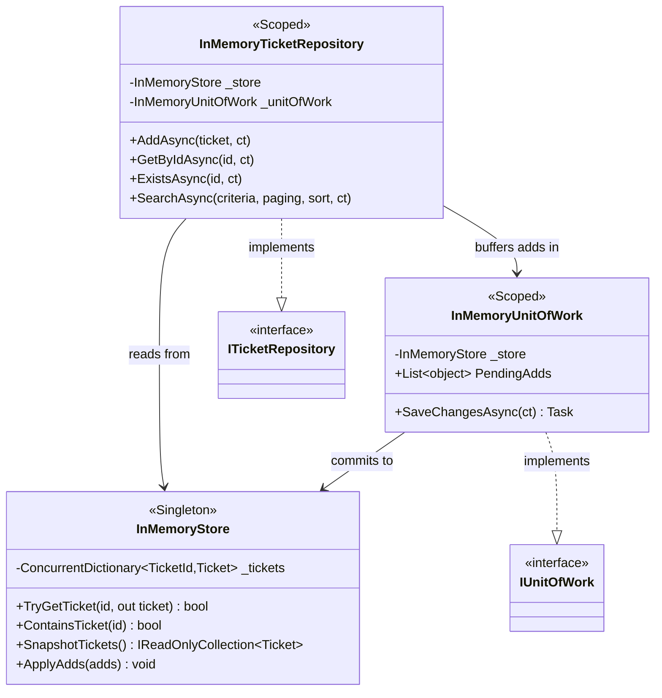
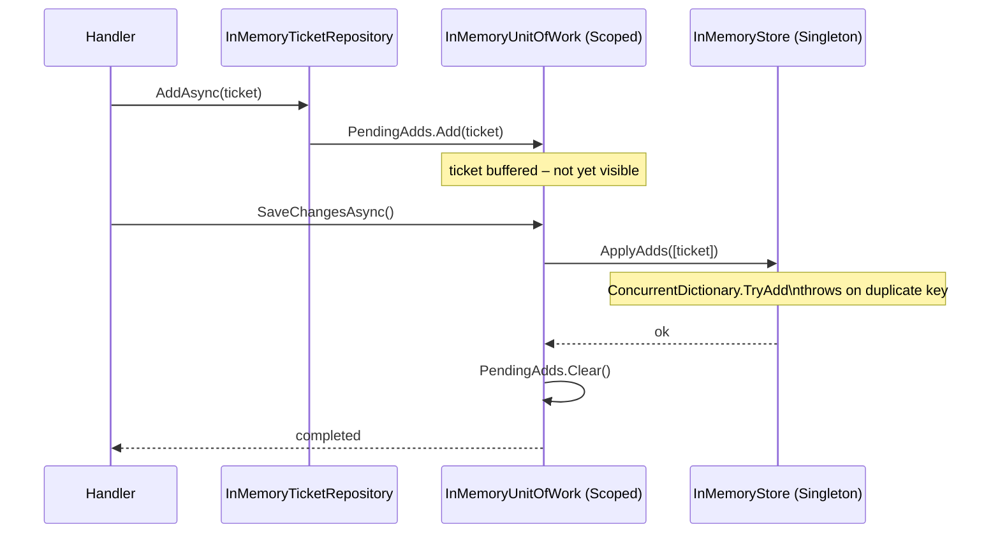

## Infrastructure – InMemory (`ServiceDeskLite.Infrastructure.InMemory`)

#### `InMemoryStore` – Singleton

```csharp
internal sealed class InMemoryStore
{
    private readonly ConcurrentDictionary<TicketId, Ticket> _tickets = new();

    public bool TryGetTicket(TicketId id, out Ticket? ticket)
    public bool ContainsTicket(TicketId id)
    public IReadOnlyCollection<Ticket> SnapshotTickets()
    public void ApplyAdds(IEnumerable<Ticket> adds)   // Throws on duplicate
}
```
Data persists for the application lifetime. Shared across all scoped requests.

#### `InMemoryUnitOfWork` – Scoped

```csharp
internal sealed class InMemoryUnitOfWork : IUnitOfWork
{
    internal List<object> PendingAdds { get; } = [];

    public Task SaveChangesAsync(CancellationToken ct = default)
    {
        var ticketAdds = PendingAdds.OfType<Ticket>().ToArray();
        if (ticketAdds.Length > 0) _store.ApplyAdds(ticketAdds);
        PendingAdds.Clear();
    }
}
```

#### InMemoryTicketRepository – Scoped

- `AddAsync` → appends to `unitOfWork.PendingAdds`
- `GetByIdAsync` / `ExistsAsync` → synchronous lookup on `InMemoryStore`
- `SearchAsync` → LINQ in-memory with same filter/sort logic; tie-breaker: `.ThenBy(t => t.Id.Value)`

#### Component Relationships



#### Unit of Work Commit Boundary

The two-phase write (buffer → commit) prevents partially visible state within a request scope.



#### DI Lifetime Summary

| Type                       | Lifetime  | Reason                         |
|----------------------------|-----------|--------------------------------|
| `InMemoryStore`            | Singleton | Shared in-process state        |
| `InMemoryUnitOfWork`       | Scoped    | Per-request change set         |
| `InMemoryTicketRepository` | Scoped    | References scoped UoW          |
| `EfTicketRepository`       | Scoped    | DbContext is Scoped            |
| `EfUnitOfWork`             | Scoped    | DbContext is Scoped            |
| Use-case handlers          | Scoped    | Reference Scoped repositories  |