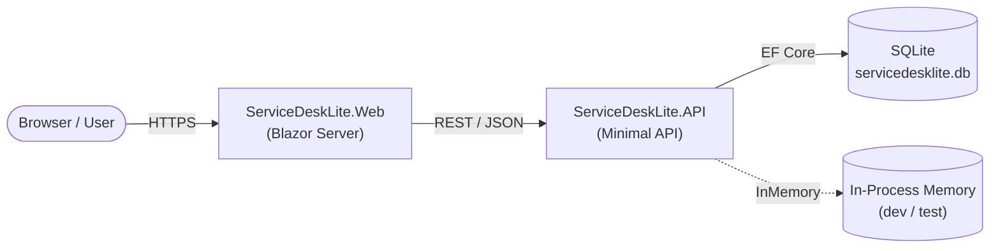
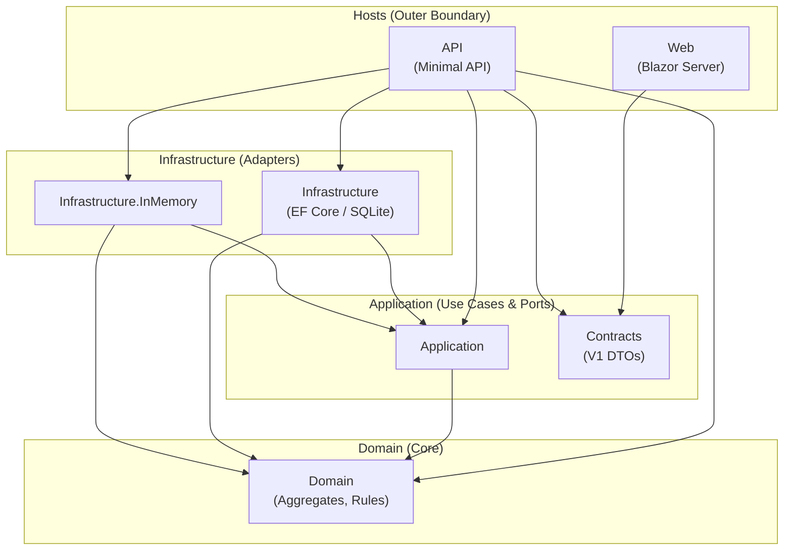

# Architecture Overview

ServiceDeskLite is structured as a strict layered system with inward-only dependencies.
The goal is a portfolio-grade reference for Clean Architecture with explicit domain rules and an explicit error strategy.

---

## System Context

---

## Tech Summary

- .NET 10
- ASP.NET Core Minimal API + OpenAPI
- Blazor Interactive Server (MudBlazor, Bootstrap 5)
- EF Core 10
- SQLite (production) + InMemory provider (dev/test)
- xUnit + FluentAssertions + Microsoft.AspNetCore.Mvc.Testing
- Serilog

---

## Solution Structure (High-Level)

- `Domain`: Aggregates, workflow rules, guards, domain exceptions
- `Application`: Use cases, `Result` / `Result<T>`, abstractions
- `Contracts`: Versioned HTTP DTOs (V1) shared across boundaries
- `Infrastructure`: Persistence providers + repositories
- `API`: HTTP boundary, ProblemDetails mapping, exception handling
- `Web`: UI + typed API client

---

## Dependency Rules

Dependencies must point strictly **inward**. No layer may reference anything from a layer that is outer to it.

Violations are blocking issues.

---

## Core Patterns

### Result-based execution
- Use-case handlers never throw for expected outcomes.
- All outcomes are represented as `Result` / `Result<T>`.
- Domain exceptions are caught in handlers and mapped to `ApplicationError`.

### RFC 9457 ProblemDetails at HTTP boundary
- API maps `ApplicationError` to RFC 9457 ProblemDetails.
- Error responses include structured extension fields (`code`, `errorType`, `traceId`, `meta`).

### Deterministic paging & sorting
- Paging is validated via a policy (min/max/default).
- Sorting is stable; ties use additional deterministic fields (e.g., `CreatedAt` + `Id`).

---

## Deep Dives

- [Domain](domain.md)
- [Application](application.md)
- [API](api.md)
- [Contracts](contracts.md)
- [Infrastructure (SQLite)](infrastructure-sqlite.md)
- [Infrastructure (InMemory)](infrastructure-inmemory.md)
- [Web Layer](web.md)