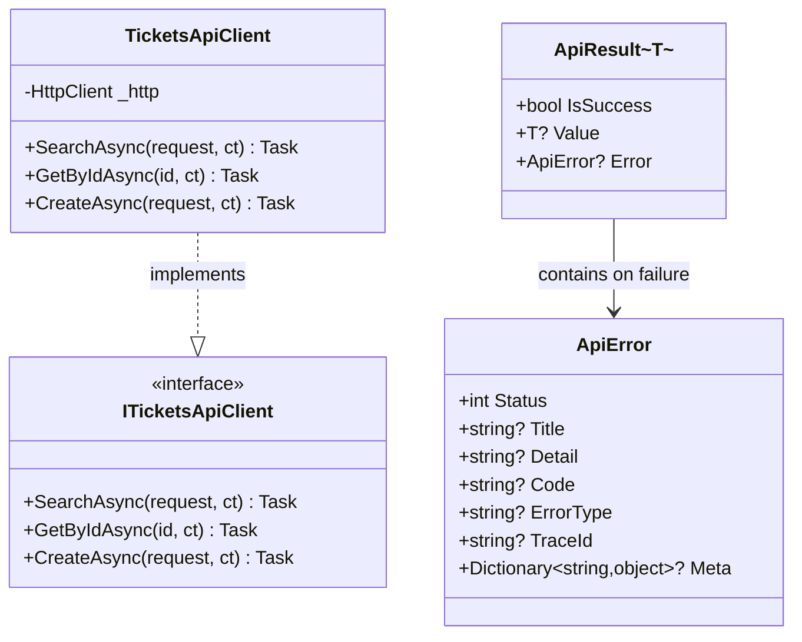
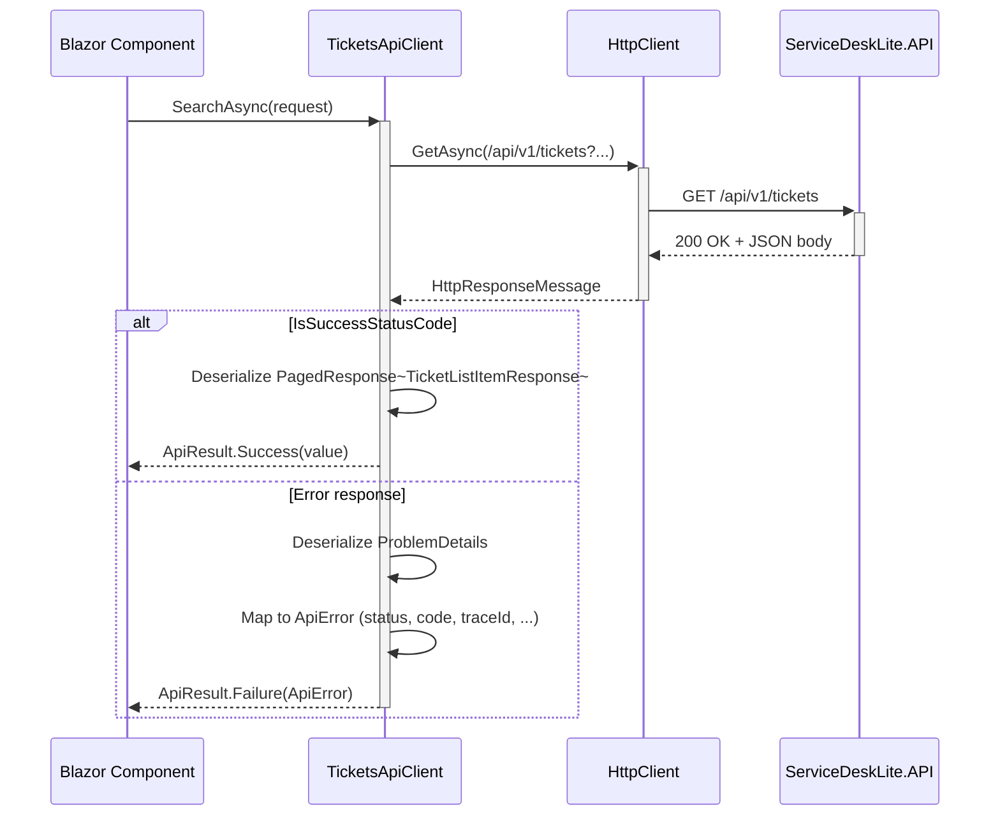

## Web Layer (`ServiceDeskLite.Web`)

#### API Client

```csharp
public interface ITicketsApiClient
{
    Task<ApiResult<PagedResponse<TicketListItemResponse>>> SearchAsync(
        SearchTicketsRequest request, CancellationToken ct = default);

    Task<ApiResult<TicketResponse>> GetByIdAsync(
        Guid id, CancellationToken ct = default);

    Task<ApiResult<CreateTicketResponse>> CreateAsync(
        CreateTicketRequest request, CancellationToken ct = default);
}
```
`TicketsApiClient` uses `HttpClient` with `PropertyNameCaseInsensitive` JSON deserialization and parses ProblemDetails from API error responses.

#### `ApiResult<T>` and `ApiError`

```csharp
public sealed class ApiResult<T>
{
    public bool IsSuccess => Error is null;
    public T? Value { get; }
    public ApiError? Error { get; }
}

public sealed class ApiError
{
    public int Status { get; init; }
    public string? Title { get; init; }
    public string? Detail { get; init; }
    public string? Code { get; init; }
    public string? ErrorType { get; init; }
    public string? TraceId { get; init; }
    public Dictionary<string, object>? Meta { get; init; }
}
```

#### Client / API Result Types



#### API Client Call Flow



#### Configuration

```json
// appsettings.Development.json (Web)
{
    "ApiClient": {
        "BaseUrl": "https://localhost:7238",
        "TimeoutSeconds": 10
    }
}
```